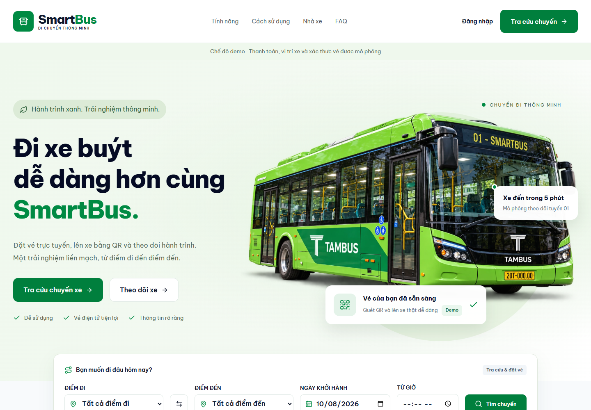

# 🚌 SmartBus — Hệ thống số hóa bán vé và quản lý xe buýt thông minh

<p align="center">
  
  
  
  
  
  
  
  
  
</p>

> **Đồ án Thực tập Cơ sở 2026 — Nhóm 5 (N5 Innovators)**
>
> **Trường Đại học Công nghệ Thông tin & Truyền thông — Đại học Thái Nguyên (ICTU)**
>
> **SmartBus** giúp hành khách tra cứu chuyến, đặt vé, nhận QR và theo dõi xe; hỗ trợ nhà xe quản lý vận hành, soát vé và báo cáo doanh thu. Frontend mới triển khai S1–S6 bằng **React + TypeScript + Vite**, mặc định chạy **chế độ demo**. Repository giữ backend Express/PostgreSQL/Redis và giao diện cũ để tiếp tục tích hợp.

Giao diện tiếng Việt, tiền tệ VND, múi giờ `Asia/Ho_Chi_Minh`. Thanh toán, vị trí xe và xác thực vé trong demo đều được mô phỏng; dữ liệu demo lưu trong trình duyệt, không đồng bộ vào Supabase. Đổi sang chế độ API cần mapping backend theo [hợp đồng frontend](frontend/API_CONTRACT.md).



Tài liệu: [Frontend](frontend/README.md) · [Checklist và kiểm chứng](frontend/IMPLEMENTATION.md) · [Hợp đồng API](frontend/API_CONTRACT.md) · [Supabase/Vercel](docs/supabase-vercel.md).

---

## 🌐 Liên kết triển khai đã cấu hình

Các URL được ghi trong tài liệu triển khai của dự án. Trạng thái phục vụ và phiên bản trên cloud cần kiểm tra riêng; push mã nguồn không phải xác nhận nghiệm thu production.

| Tài nguyên                        | Địa chỉ URL                                                                                                                                  | Ghi chú                                    |
| :-------------------------------- | :------------------------------------------------------------------------------------------------------------------------------------------- | :----------------------------------------- |
| 🚀 **Giao diện Web App (Vercel)** | [https://smart-bus-ticketing-system.vercel.app](https://smart-bus-ticketing-system.vercel.app)                                               | Phụ thuộc cấu hình và lần deploy hiện hành |
| 🔗 **Domain Dự phòng (Alias)**    | [https://project-smart-bus-ticketing-system-ictu-e8pb9rofi.vercel.app](https://project-smart-bus-ticketing-system-ictu-e8pb9rofi.vercel.app) | Domain phụ liên kết Vercel                 |
| 🩺 **Backend Health Check API**   | [https://smart-bus-ticketing-system.vercel.app/api/health](https://smart-bus-ticketing-system.vercel.app/api/health)                         | Trả về trạng thái kết nối PostgreSQL       |
| 🗄️ **Supabase Cloud Project**     | `uhoznqcpaasartfvdynx`                                                                                                                       | Quản trị bảng, RLS, Transaction Pooler     |

---

## 📌 Bảng mục lục

0. [Frontend SmartBus mới](#frontend-smartbus-mới)
1. [Kiến trúc hệ thống & Hạ tầng triển khai](#-1-kiến-trúc-hệ-thống--hạ-tầng-triển-khai)
2. [Các phân hệ backend và giao diện legacy](#-2-các-phân-hệ-backend-và-giao-diện-legacy)
3. [Tạo tài khoản quản trị](#-3-tạo-tài-khoản-quản-trị)
4. [Hướng dẫn cài đặt & Khởi chạy cục bộ](#-4-hướng-dẫn-cài-đặt--khởi-chạy-cục-bộ)
5. [Cấu trúc thư mục mã nguồn](#-5-cấu-trúc-thư-mục-mã-nguồn)
6. [Danh mục RESTful API Backend](#-6-danh-mục-restful-api-backend)
7. [Cấu hình biến môi trường](#-7-cấu-hình-biến-môi-trường)
8. [Các tính năng nâng cao & Hoàn thiện hệ thống](#-8-các-tính-năng-nâng-cao--hoàn-thiện-hệ-thống-sprint-cuối)
9. [Đội ngũ phát triển (Team 5 - N5 Innovators)](#-9-đội-ngũ-phát-triển-team-5---n5-innovators)

---

## Frontend SmartBus mới

### Công nghệ

React 19, TypeScript, Vite 8, React Router, CSS Modules và CSS variables; anime.js **v4** dùng scope, timeline và cleanup, tôn trọng reduced motion. TanStack Query + Axios quản lý dữ liệu dịch vụ; Zustand lưu phiên và bản nháp; React Hook Form + Zod xác thực biểu mẫu. Leaflet qua adapter bản đồ, Recharts cho dashboard, thư viện QR cho hiển thị/soát vé, ExcelJS và jsPDF cho export.

### Chức năng S1–S6 trong demo

| Nhóm                  | Chức năng đã triển khai                                                                                                        |
| :-------------------- | :----------------------------------------------------------------------------------------------------------------------------- |
| Landing và xác thực   | Landing responsive, minh họa TAMBUS, animation, đăng nhập/đăng ký/quên mật khẩu, hồ sơ, guard và trang 403/404                 |
| Đặt vé                | Tìm chuyến và trạm trung gian, chi tiết chuyến, chọn ghế hoặc mua vé không ghế, giữ chỗ 10 phút theo `expiresAt`               |
| Thanh toán và vé      | Adapter MoMo/VNPay/ZaloPay/thẻ, pending/paid/failed/canceled, QR sau xác nhận paid, lịch sử, yêu cầu hủy/đổi và hoàn tiền demo |
| Tracking và nhân viên | Vị trí/ETA mô phỏng, mất tín hiệu/kết nối lại, sự cố, camera đọc QR hoặc nhập mã, kiểm tra đúng chuyến/hết hạn/đã dùng         |
| Điều hành             | Tuyến, trạm, giá vé, lịch chạy, xe, nhân sự, phân công chuyến và duyệt hồ sơ ưu đãi                                            |
| Quản trị và báo cáo   | Vé tháng, voucher, thông báo, phản ánh, tài khoản/quyền/nhật ký, bộ lọc doanh thu và export Excel/PDF                          |

Các thao tác demo cập nhật dữ liệu liên quan trong cùng trình duyệt. Refresh không kéo dài thời hạn hold; query callback không tự xác nhận thanh toán. QR/token được ẩn khi vé hết hạn, đã hủy hoặc đã sử dụng.

### Chạy nhanh frontend, không cần backend

Khuyến nghị Node.js 24 và npm 11 (môi trường kiểm chứng). Dependency được chốt trong `frontend/package-lock.json`.

```powershell
git clone https://github.com/tamtran2k6zz/Project_Smart_Bus_Ticketing_System_ictu.git
cd Project_Smart_Bus_Ticketing_System_ictu/frontend
npm ci
Copy-Item .env.example .env.local
npm run dev
```

Mở [http://localhost:3000](http://localhost:3000) hoặc [trang đăng nhập](http://localhost:3000/login). Nếu Docker đang chiếm cổng 3000, dùng `npm run dev -- --port 3010 --strictPort`; cổng 3010 chỉ truy cập được khi tiến trình Vite này đang chạy.

Trong `frontend/.env.local`, mặc định dùng:

```dotenv
VITE_APP_MODE=demo
VITE_API_BASE_URL=/api/smartbus/v1
VITE_LEGACY_APP=false
```

Trang đăng nhập có nút trải nghiệm theo vai trò. Tài khoản sau **chỉ thuộc dữ liệu demo trong trình duyệt**, không phải tài khoản backend/Supabase; mật khẩu chung `SmartBus123!`.

| Vai trò         | Email demo                |
| :-------------- | :------------------------ |
| Hành khách      | `passenger@smartbus.demo` |
| Tài xế / phụ xe | `driver@smartbus.demo`    |
| Điều hành       | `manager@smartbus.demo`   |
| Tài chính       | `finance@smartbus.demo`   |
| Quản trị viên   | `admin@smartbus.demo`     |

Luồng thử: tìm chuyến tương lai → chọn ghế/loại vé → giữ chỗ → checkout → khởi tạo giao dịch demo → chọn kết quả mô phỏng → xem QR/lịch sử. Dữ liệu ban đầu gồm 8 ngày; xóa localStorage để khởi tạo lại demo.

### Route chính

| Khu vực    | Đường dẫn                                                                                                                             |
| :--------- | :------------------------------------------------------------------------------------------------------------------------------------ |
| Công khai  | `/`, `/trips`, `/trips/:tripId`, `/tracking/:tripId`                                                                                  |
| Xác thực   | `/login`, `/register`, `/forgot-password`                                                                                             |
| Đặt vé     | `/booking/:tripId`, `/checkout/:bookingId`, `/payment/result`                                                                         |
| Hành khách | `/account/tickets`, `/account/tickets/:ticketId`, `/account/passes`, `/account/notifications`, `/account/support`, `/account/profile` |
| Quản trị   | `/admin` và các trang vận hành, báo cáo, ưu đãi, tài khoản, nhật ký, hỗ trợ                                                           |
| Nhân viên  | `/staff/trips`, `/staff/scan`, `/staff/incidents`                                                                                     |

Frontend mới có 5 vai trò, gồm `FINANCE`; backend/giao diện cũ có hợp đồng quyền riêng. Frontend guard không thay thế kiểm tra quyền tại API thật.

### Tích hợp còn thiếu

Đặt `VITE_APP_MODE=api` và cấu hình `VITE_API_BASE_URL` sau khi backend cung cấp hợp đồng mới hoặc có lớp mapping. Backend hiện có `/api/v1/*`; frontend mới mặc định dùng `/api/smartbus/v1`, nên đổi env đơn thuần chưa hoàn tất tích hợp. Chế độ API không tự fallback về demo.

Cần nối xác thực phiên/cookie, tồn ghế/hold/giá server, webhook thanh toán, hoàn tiền/hóa đơn thật, QR validation, GPS/ETA và push/email/SMS. Backend đã có module QR, GPS/WebSocket và thông báo nhưng adapter frontend mới cần kết nối và kiểm chứng. Bản đồ chưa cấu hình tile chỉ là sơ đồ tuyến; dự báo nhu cầu chưa triển khai vì chưa có dữ liệu/API.

Để dùng giao diện cũ với API cũ, đặt `VITE_LEGACY_APP=true` trong môi trường frontend và chạy/build lại. Luồng `/passenger/booking` → `/payment` được mô tả ở phần backend/legacy bên dưới.

---

## 🏗️ 1. Kiến trúc hệ thống & Hạ tầng triển khai

### A. Môi trường Đám mây (Production — Vercel + Supabase)

Hệ thống sử dụng mô hình kiến trúc Serverless Micro-Architecture kết hợp Single-Page Application (SPA):

- **Frontend:** React 19 / Vite SPA; chế độ demo/API và giao diện mới/cũ được chọn lúc build bằng biến `VITE_*`.
- **Backend API:** Entrypoint `api/index.ts` điều hướng toàn bộ yêu cầu `/api/*` tới Express Engine (Node.js Serverless Function).
- **Database:** **Supabase PostgreSQL** kết nối qua Transaction Pooler (PgBouncer cổng `6543`) tối ưu tài nguyên kết nối serverless; bảo mật toàn diện qua **Row-Level Security (RLS)** trên 14 bảng.

```
                              [ Người dùng / Trình duyệt ]
                                           │
                                           ▼ (HTTPS)
                     ┌───────────────────────────────────────────┐
                     │            Vercel Edge Network            │
                     │  https://smart-bus-ticketing-system.vercel.app  │
                     └─────────────────────┬─────────────────────┘
                                           │
                     ┌─────────────────────┴─────────────────────┐
                     │                                           │
              [ Định tuyến tĩnh ]                         [ Định tuyến API ]
                     │                                           │
                     ▼                                           ▼
       ┌───────────────────────────┐               ┌───────────────────────────┐
       │   Frontend SPA (dist/)    │               │    Serverless Function    │
       │   React 19 + CSS         │               │      (api/index.ts)       │
       │   Client-side Routing     │               │   Express RESTful Engine  │
       └───────────────────────────┘               └─────────────┬─────────────┘
                                                                 │
                                                    (PostgreSQL Connection Pool)
                                                                 │
                                                                 ▼
                                                   ┌───────────────────────────┐
                                                   │    Supabase PostgreSQL    │
                                                   │ (Transaction Pooler 6543) │
                                                   │ 14 Tables • RLS Protected │
                                                   └───────────────────────────┘
```

### B. Môi trường Cục bộ (Local — Docker Compose)

Docker Compose chạy frontend, Express API và Redis cục bộ; API kết nối tới PostgreSQL dùng chung trên Supabase qua `DATABASE_URL`. Máy chạy ứng dụng cần Internet và file `.env` riêng. Không khởi chạy PostgreSQL cục bộ; publishable key và Project URL không thay thế connection string của database.

---

## ✨ 2. Các phân hệ backend và giao diện legacy

Phần này mô tả nghiệp vụ của backend/giao diện cũ. Trạng thái tích hợp frontend SmartBus mới được ghi ở phần trên.

### 🔐 A. Phân hệ Xác thực & Phân quyền RBAC (US 22)

- **Đăng ký / Đăng nhập:** Hỗ trợ đăng nhập linh hoạt bằng Email hoặc Số điện thoại.
- **Mã hóa bảo mật:** Mật khẩu được băm qua thuật toán `bcrypt` (Salt rounds = 10), cấp phát mã thông hành JSON Web Token (JWT) thời hạn 24 giờ.
- **Phân quyền 4 vai trò:** `ADMIN`, `MANAGER`, `DRIVER`, `PASSENGER`.
- **Bảo mật tuyến đường:**
  - `ProtectedRoute`: Kiểm tra Token hợp lệ và đối soát mảng vai trò được cấp phép.
  - `PublicRoute`: Tự động nhận diện tài khoản đã đăng nhập để chuyển hướng vào cổng nghiệp vụ tương ứng.

### 🚍 B. Phân hệ Quản trị Tuyến & Trạm dừng (US 12 - Admin & Manager)

- Quản lý danh mục tuyến buýt, cự ly (km), biểu phí quy định và thời gian hành trình.
- Sắp xếp thứ tự các trạm dừng đón/trả khách thông minh qua cơ chế kéo thả trực quan (**Drag & Drop** thư viện `@dnd-kit`).
- Cấu hình trạm dừng, tọa độ GPS (kinh độ, vĩ độ) phục vụ định vị bản đồ.

### 🎟️ C. Phân hệ Sơ đồ ghế & Đặt vé thông minh (US 02, 03, 04, 06 & BE 1)

- **Sơ đồ 40 chỗ ngồi thời gian thực:** Hiển thị trực quan theo tầng và vị trí (ghế trống, ghế đang chọn, ghế đã bán).
- **Khóa ghế nguyên tử (Atomic Seat Locking):** Cơ chế chống Race Condition khi nhiều người cùng đặt 1 ghế trong cùng 1 thời điểm; ghế được giữ chỗ tối đa 10 phút.
- **Phát hành vé điện tử:** Tự động tạo mã vé chuẩn hóa (`TKT-A08-XXXX`) kèm giá vé và thông tin hành trình.
- **Mã QR Scannable độ nét cao:** Tích hợp bộ giải mã/tạo mã QR tương thích hoàn hảo với camera của tài xế và nhân viên soát vé.

### 📱 D. Phân hệ Cổng thông tin Tài xế (Driver Portal)

- **Soát vé QR tức thời (US 15):** Quét mã QR trực tiếp từ màn hình hành khách hoặc nhập mã vé. Kiểm tra đối soát trạng thái vé trong CSDL, ngăn ngừa gian lận vé trùng và chuyển trạng thái vé sang `CHECKED_IN`.
- **Báo cáo sự cố hành trình (US 11):** Cho phép tài xế gửi nhanh báo cáo ùn tắc, hỏng xe hoặc tai nạn kèm thời gian trễ dự kiến về trung tâm điều hành.

### 👤 E. Phân hệ Cổng thông tin Hành khách (Passenger Portal)

- Tra cứu danh sách vé điện tử đã đặt, xem chi tiết vé và xuất trình mã QR soát vé.
- **Đánh giá & Góp ý dịch vụ (US 24):** Chấm điểm sao (1 - 5 sao) và gửi phản ánh chất lượng phục vụ lưu trực tiếp vào CSDL.
- **Đăng ký trợ giá HSSV (US 17):** Gửi hồ sơ thẻ học sinh - sinh viên trực tuyến để xét duyệt chính sách giảm 50% giá vé.

### 🔍 F. Phân hệ Tra cứu Tuyến & Chuyến xe (US 01)

- Tra cứu chuyến xe xuất bến theo điểm xuất phát, điểm đến và ngày khởi hành mong muốn.
- Tự động tính toán số ghế trống còn lại theo thời gian thực và thời gian dự kiến đến từng trạm.

### 📊 G. Bảng điều khiển Vận hành & Báo cáo (Dashboard & Operations)

- Báo cáo tổng hợp số lượng tuyến, số lượt xe đang chạy, tỷ lệ lấp đầy ghế bình quân và doanh thu theo ngày/tháng.

### 💡 H. Các tính năng nâng cao & Cải tiến mới (Sprint Hoàn thiện)

- **Đặt vé nhiều lần & Giữ chuyến đến khi xuất bến:** Chuyến xe được duy trì trạng thái hoạt động cho đến thời điểm xuất phát, cho phép hành khách đặt nhiều vé, nhiều chỗ ngồi trên cùng một chuyến một cách linh hoạt.
- **Tải ảnh QR vé về máy:** Nút "Lưu ảnh QR về máy" cho phép xuất hình ảnh PNG chất lượng cao cho cả mã QR thông tin giao dịch đặt chỗ và mã QR soát vé.
- **Quản lý & Hủy vé trực tuyến / Hoàn tiền tự động (_Soft Refund_):** Hỗ trợ hủy vé cho cả trạng thái `RESERVED` (giữ chỗ) và `BOOKED` (đã xác nhận), tích hợp cơ chế hoàn tiền tự động và trả ghế trống về CSDL.
- **Vé của tôi & Lịch sử đặt vé toàn diện (`myTickets` / `GET /api/v1/ticketing/my-tickets`):** Lưu trữ và hiển thị đầy đủ toàn bộ lịch sử vé điện tử đã đặt của hành khách, đồng bộ hóa trực tiếp từ PostgreSQL và lưu trữ phiên qua `localStorage`.
- **Khôi phục đặt chỗ:** Lưu bản nháp chuyến, ghế và voucher theo tài khoản trong `sessionStorage`, có thời hạn 30 phút; lưu giao dịch đã tạo trong `localStorage` trước khi chuyển sang cổng thanh toán.
- **Xác nhận đăng ký tài khoản qua Email thật (`nodemailer`):** Gửi email thông tin khởi tạo tài khoản xác thực tới hộp thư thật của người dùng khi đăng ký mới.
- **Hỗ trợ Docker Desktop:** Đóng gói và chạy ổn định qua `docker compose` trên môi trường Docker Desktop.

### 💳 I. Luồng thanh toán legacy VNPay / MoMo / QR demo

1. Vào `/passenger/booking`, chọn chuyến và một ghế trống. Nút **Tiếp tục thanh toán** mở `/payment`; bước này chưa tạo giao dịch hoặc giữ ghế.
2. Tại `/payment`, kiểm tra thông tin đặt chỗ và chọn **VNPay**, **MoMo** hoặc **QR (demo)**. Bấm xác nhận để gọi `POST /api/v1/ticketing/bookings`; máy chủ xác định giá vé và giữ ghế tối đa 10 phút. Nút gửi được khóa trong khi xử lý để tránh tạo nhiều giao dịch khi bấm liên tiếp.
3. Với VNPay/MoMo, trình duyệt chuyển sang URL HTTPS của cổng đã được cho phép. Kết quả được hiển thị tại `/payment/result`, đọc mã giao dịch từ `orderId` hoặc `paymentOrder` và tra cứu trạng thái từ API; không xác nhận thanh toán dựa trên query URL.
4. Với QR demo, người dùng quay về trang đặt vé để xem QR thông tin giao dịch. QR này không chuyển tiền. Nút **Hoàn thành chuyến đi (demo)** mô phỏng xác nhận thanh toán/vé và hoàn thành chuyến trên dữ liệu chung, sau đó mở phần đánh giá.
5. Trang kết quả hỗ trợ **Xem vé**, **Thử lại** khi giao dịch thất bại và tự kiểm tra giao dịch đang chờ tối đa 10 lần, mỗi 3 giây. **Xem vé** mở tab lịch sử và đánh dấu vé tương ứng; callback cũ về trang đặt vé được chuyển tiếp sang trang kết quả.

Khi tải lại hoặc mở `/payment` trong cùng tab, hệ thống khôi phục bản nháp còn hạn. Nếu bản nháp không còn nhưng có phiên giao dịch đã tạo, hệ thống mở kết quả giao dịch đó. Khi chưa có dữ liệu, trang vẫn có **Quay lại** và **Chọn chuyến xe**. Nút **Quay lại** giữ đúng chuyến, ghế và voucher; ghế chỉ được chọn lại nếu API xác nhận vẫn trống.

Sơ đồ ghế cập nhật mỗi 3 giây, có trạng thái đang tải, thông báo lỗi và nút **Thử lại tải ghế**. Khi ghế đã chọn không còn trống, lựa chọn bị xóa và nút tiếp tục bị vô hiệu hóa. Khi API trả `401`, người dùng có thể đăng nhập lại.

---

## 🔑 3. Tạo tài khoản quản trị

Backend không dùng các tài khoản demo của frontend. Khi khởi tạo database trống, tạo admin bằng
`ADMIN_EMAIL` và `ADMIN_PASSWORD` riêng theo hướng dẫn tại [docs/supabase-vercel.md](docs/supabase-vercel.md).
Nếu môi trường đã từng dùng tài khoản mẫu, hãy đổi mật khẩu hoặc vô hiệu hóa các tài khoản đó trong database.

---

## 🚀 4. Hướng dẫn cài đặt & Khởi chạy cục bộ

### Lựa chọn 1: Frontend demo độc lập

Làm theo [hướng dẫn chạy nhanh](#chạy-nhanh-frontend-không-cần-backend) phía trên. Không cần Supabase, Redis hoặc thông tin merchant cho luồng này.

---

### Lựa chọn 2: Khởi chạy bằng Docker Compose

**Yêu cầu:** Máy tính đã cài đặt [Docker Desktop](https://www.docker.com/).

Compose chạy frontend + backend + Redis; cần `.env` gốc với `DATABASE_URL` và `JWT_SECRET`, dù frontend mới mặc định là demo. Database dùng Supabase, không có PostgreSQL cục bộ trong Compose hiện tại. Biến `VITE_*` nằm trong môi trường frontend và được áp dụng khi build.

```bash
# 1. Clone repository
git clone https://github.com/tamtran2k6zz/Project_Smart_Bus_Ticketing_System_ictu.git
cd Project_Smart_Bus_Ticketing_System_ictu

# 2. Tạo file môi trường riêng từ mẫu (PowerShell: Copy-Item .env.example .env)
cp .env.example .env

# 3. Mở .env và điền:
#    - DATABASE_URL: Transaction pooler URL từ Supabase > Connect.
#    - JWT_SECRET: chuỗi ngẫu nhiên ít nhất 32 ký tự. Có thể tạo bằng PowerShell:
#    Không dùng publishable key/service-role key thay DATABASE_URL.
#    Không commit .env; chỉ chia sẻ DATABASE_URL với tester đáng tin cậy.

# 4. Khởi chạy frontend, API và Redis; database dùng chung trên Supabase
docker compose up -d --build
```

Tạo `JWT_SECRET` ngẫu nhiên bằng PowerShell:

```powershell
$bytes = New-Object byte[] 32
$rng = [Security.Cryptography.RandomNumberGenerator]::Create()
$rng.GetBytes($bytes)
[Convert]::ToBase64String($bytes)
```

Mỗi backend cần có `JWT_SECRET` riêng tư tối thiểu 32 ký tự để ký token đăng nhập. Nếu cần một token được xác thực bởi nhiều backend, các backend đó phải dùng cùng secret; nếu mỗi tester chỉ dùng backend của máy mình thì có thể tự tạo secret riêng.

**Truy cập dịch vụ sau khi khởi chạy:**

- 🌐 **Frontend Web App:** [http://localhost:3000](http://localhost:3000)
- 🔐 **Backend Health Check:** [http://localhost:3000/api/health](http://localhost:3000/api/health)
- 🔌 **Backend API trực tiếp:** [http://localhost:5000/api/health](http://localhost:5000/api/health)

Backend được publish ở cổng `5000` để máy host và callback dịch vụ thanh toán có thể truy cập trực tiếp; frontend vẫn gọi API qua Nginx. Redis chỉ được expose trong mạng Docker. Nếu cổng `3000` đã được dùng, đặt `FRONTEND_PORT=3001` (hoặc cổng trống khác) trong `.env` rồi truy cập `http://localhost:3001`.

Sau khi pull mã mới, nếu backend của stack đã chạy, cập nhật riêng frontend:

```powershell
git pull --ff-only
docker compose up -d --no-deps --build frontend
docker compose ps
docker compose logs --tail 50 frontend
```

Mở đúng cổng `FRONTEND_PORT` (mặc định **3000**) và nhấn `Ctrl + F5`. Build image chưa đồng nghĩa container đã chạy; nếu trình duyệt báo từ chối kết nối, kiểm tra trạng thái container và log. Cổng 3010 của Vite không phải cổng Docker mặc định.

Các backend cùng cấu hình Supabase dùng chung dữ liệu database; frontend demo vẫn lưu dữ liệu riêng trong trình duyệt. Chỉ cấp `DATABASE_URL` cho người đáng tin cậy; backend dùng tài khoản database có quyền truy cập, vì vậy không commit URL/mật khẩu vào GitHub. Sao chép nguyên Transaction pooler URL từ Supabase và percent-encode ký tự đặc biệt trong mật khẩu. Chạy migration Supabase một lần bởi người quản lý database, không chạy lại từ từng máy clone. Sau khi cập nhật mã nguồn có migration mới, người quản lý chạy `npm run db:migrate` trong thư mục `backend` trước khi bật luồng QR.

Redis mặc định chạy riêng trên từng máy. Điều này phù hợp để chạy độc lập, nhưng Redis seat-lock không đồng bộ giữa các máy; nếu cần khóa ghế tạm thời dùng chung, cấu hình cùng một Redis URL riêng tư qua `REDIS_URL` trên các máy. Không đưa thông tin Redis bí mật vào repository.

---

### Lựa chọn 3: Chạy trực tiếp bằng Node.js / Vite (Phát triển tính năng)

**Yêu cầu:** Node.js `20.19+` hoặc `22.12+` (theo yêu cầu của Vite 8), cùng npm.

```bash
# 1. Cài đặt dependencies cho Backend
cd backend
npm ci
cp ../.env.example .env
# PowerShell: Copy-Item ..\.env.example .env
# (Điền DATABASE_URL và JWT_SECRET vào backend/.env)

# 2. Chạy migration CSDL
npm run db:migrate

# 3. Khởi chạy Backend Express Server (Cổng 5000)
npm run start:express
```

Mở một cửa sổ Terminal mới để khởi chạy Frontend:

```bash
# 4. Cài đặt dependencies và chạy Frontend (mặc định cổng 3000)
cd frontend
npm ci
npm run dev
```

---

### 🧪 Build & Bộ Kiểm thử Tự động (Automated Test Suite)

Chạy từ thư mục gốc repository sau khi đã cài dependencies cho cả `backend` và `frontend`:

```bash
npm run build:frontend
npm run build:backend
npm --prefix frontend run lint
npm test
```

`npm test` chạy Jest cho backend, các kiểm thử theme bằng Node.js và Vitest cho frontend. Kiểm thử thanh toán bao gồm khôi phục bản nháp theo tài khoản, dữ liệu lưu bị hỏng/hết hạn, gửi phương thức và voucher, QR demo, lỗi giữ ghế và giới hạn URL chuyển hướng.

Kiểm tra riêng frontend SmartBus mới (chạy trong `frontend/`):

```powershell
npm run typecheck
npm run lint
npm test
npm run build
npx playwright install chromium
npm run test:e2e
```

Nếu Vitest gặp timeout khởi động forks worker trên Windows, chạy `npx vitest run --pool=threads --maxWorkers=1`. Playwright mặc định dùng cổng 3000; đặt `$env:PLAYWRIGHT_PORT='3010'` nếu cổng này đã có dịch vụ khác. Có thể dùng Chrome đã cài bằng `$env:PLAYWRIGHT_EXECUTABLE_PATH='C:\Program Files\Google\Chrome\Application\chrome.exe'`.

Kiểm chứng frontend ngày 08/10/2026 sau cập nhật `main`: lint, TypeScript và production build đạt; Node legacy **8/8**, Vitest/RTL **36/36** đạt (lượt chạy threads). Hai E2E xác thực desktop/mobile trên Docker đạt **2/2** sau sửa giao diện. Các lần kiểm thử responsive 360/768/1280/1440, hold, thanh toán, QR, tracking, quyền và export được ghi theo từng mốc trong [IMPLEMENTATION.md](frontend/IMPLEMENTATION.md).

Nếu backend build báo thiếu `qrcode` hoặc `@types/qrcode`, chạy lại `npm ci` trong thư mục `backend`. Hai package đã có trong `backend/package.json` và lockfile; không cần sửa mã nguồn để xử lý việc cài dependencies thiếu.

Dự án còn có bộ kiểm thử API với PostgreSQL nhúng (**PGlite**), không cần kết nối database bên ngoài:

```bash
npm --prefix backend run test:postgres
```

Bộ kiểm thử tự động xác minh:

- Quy trình đăng ký, đăng nhập và phân quyền JWT RBAC.
- Cơ chế tạo và quản trị Tuyến buýt & Trạm dừng.
- Khóa ghế nguyên tử chống đặt trùng lặp (Concurrency & Atomic Seat Locking).
- Phát hành vé, sinh mã QR và luồng soát vé `CHECKED_IN`.
- Kiểm tra chính sách Row-Level Security (RLS) chặn truy cập trái phép.

Kiểm thử tự động và kiểm tra trình duyệt dùng API/cổng giả lập không thay thế nghiệm thu giao dịch thật. Trước khi dùng VNPay/MoMo thực tế, cần cấu hình merchant, callback/IPN công khai và kiểm tra xác nhận, thất bại, hết hạn giữ ghế, hủy vé và hoàn tiền trong môi trường của cổng thanh toán.

---

## 📂 5. Cấu trúc thư mục mã nguồn

```plaintext
Project_Smart_Bus_Ticketing_System_ictu/
├── .vercel/                           # Cấu hình liên kết dự án Vercel
├── api/
│   └── index.ts                       # Entrypoint Vercel Serverless Function cho Express
├── backend/
│   ├── scripts/
│   │   ├── migrate-postgres.cjs       # Trình thực thi Migration PostgreSQL
│   │   ├── test-postgres.cjs          # Kiểm thử API với PostgreSQL nhúng
│   │   └── create-admin.cjs           # Tiện ích tạo tài khoản quản trị viên
│   ├── src/
│   │   ├── config/
│   │   │   ├── database.ts            # PostgreSQL Pool Client (node-postgres)
│   │   │   ├── auth.ts                # Cấu hình mã hóa JWT & Secret
│   │   │   ├── env.ts                 # Nguồn cấu hình duy nhất + kiểm tra biến môi trường
│   │   │   ├── logger.ts              # Log có cấu trúc key=value, tự che bí mật
│   │   │   └── redis.ts               # Redis client & khoá ghế tạm (tuỳ chọn)
│   │   ├── controllers/
│   │   │   ├── auth.controller.ts     # Xử lý Đăng ký / Đăng nhập
│   │   │   ├── routes.controller.ts   # Quản lý Tuyến buýt
│   │   │   ├── stops.controller.ts    # Quản lý Trạm dừng
│   │   │   ├── trips.controller.ts    # Tìm kiếm chuyến xe
│   │   │   └── seats.controller.ts    # Sơ đồ 40 ghế & Khóa giữ chỗ
│   │   ├── middlewares/
│   │   │   └── auth.ts                # Middleware xác thực JWT & Phân quyền RBAC
│   │   ├── routes/                    # Định tuyến API Express
│   │   ├── services/
│   │   │   ├── booking.ts                   # Đặt vé & giữ ghế (khoá dòng PostgreSQL)
│   │   │   ├── payment-gateway.service.ts   # Ký & kiểm tra chữ ký VNPay / MoMo
│   │   │   └── payment-refund.service.ts     # Hoàn tiền VNPay / MoMo
│   │   ├── app.ts                     # Cấu hình Express App, CORS, Health, Error Handler
│   │   └── server.ts                  # Điểm khởi chạy Local HTTP Server (Port 5000)
│   ├── Dockerfile                     # Dockerfile đóng gói Backend Node.js
│   └── package.json
├── frontend/
│   ├── src/
│   │   ├── api/
│   │   │   └── client.ts              # Axios Client tự động thích ứng Vercel/Local
│   │   ├── assets/                    # CSS tokens/global, ảnh TAMBUS và minh họa
│   │   ├── components/                # UI dùng chung, Header, form, modal, bảng
│   │   ├── configs/                   # App config, route constants và permissions
│   │   ├── context/
│   │   │   └── AuthContext.tsx        # Phiên/token của giao diện legacy
│   │   ├── features/                  # Nghiệp vụ, component, service và types
│   │   ├── hooks/                     # Anime scope, reduced motion và UI hooks
│   │   ├── layouts/                   # Main/Auth/Passenger/Admin/Staff
│   │   ├── pages/                     # Ghép màn hình; giữ các trang legacy
│   │   ├── routes/                    # AppRouter, ProtectedRoute, PermissionGuard
│   │   ├── services/                  # Axios HTTP, adapter, Query client và DB demo
│   │   ├── store/                     # Zustand cho session, UI và booking draft
│   │   ├── utils/                     # Định dạng VND/thời gian và tiện ích legacy
│   │   ├── LegacyApp.tsx              # Entrypoint giao diện cũ
│   │   ├── App.tsx                    # Query provider, Router & ErrorBoundary
│   │   └── main.tsx
│   ├── tests/e2e/                     # Kiểm thử nghiệp vụ/responsive bằng Playwright
│   ├── docs/previews/                 # Ảnh giao diện đã kiểm chứng
│   ├── API_CONTRACT.md                # Hợp đồng cần nối backend cho frontend mới
│   ├── IMPLEMENTATION.md              # Checklist S1–S6 và kết quả kiểm chứng
│   ├── README.md                      # Hướng dẫn chi tiết frontend
│   ├── nginx.conf                     # Cấu hình Nginx Reverse Proxy trong Docker
│   ├── Dockerfile                     # Dockerfile Multi-stage build Nginx Alpine
│   └── package.json
├── supabase/
│   └── migrations/                    # File Migration cấu trúc CSDL PostgreSQL & RLS
├── docs/                              # Tài liệu Báo cáo Sprint, Slide & Sơ đồ ERD
├── docker-compose.yml                 # Cấu hình điều phối Container cục bộ
├── vercel.json                        # Cấu hình điều phối Deployment trên Vercel
└── README.md                          # Tài liệu hướng dẫn đồ án
```

---

## 📡 6. Danh mục RESTful API Backend

Tất cả các API hỗ trợ đồng thời cả hai tiền tố định tuyến `/api` và `/api/v1`:

Đây là danh mục backend hiện có, không phải hợp đồng `/api/smartbus/v1` của frontend mới. Request/response cần được mapping theo [API_CONTRACT.md](frontend/API_CONTRACT.md) khi tích hợp.

### 1. Phân hệ Xác thực & Tài khoản (`/api/v1/auth`)

- `POST /login`: Đăng nhập bằng Email/SĐT + Mật khẩu, trả về JWT Token và thông tin User.
- `POST /register`: Đăng ký tài khoản hành khách mới vào CSDL.
- `GET /me`: Lấy thông tin tài khoản hiện tại từ JWT Bearer Header.

### 2. Phân hệ Tuyến & Trạm dừng (`/api/v1/routes`, `/api/v1/stops`)

- `GET /routes`: Lấy toàn bộ danh sách tuyến buýt đang hoạt động kèm danh sách trạm.
- `POST /routes`: Tạo mới tuyến xe buýt (Quyền `ADMIN`, `MANAGER`).
- `GET /stops`: Lấy danh mục tất cả trạm dừng xe buýt trên mạng lưới.
- `POST /stops`: Tạo trạm dừng mới kèm tọa độ GPS.

### 3. Phân hệ Chuyến xe & Tra cứu (`/api/v1/trips`)

- `GET /trips/search?origin_stop_id=...&destination_stop_id=...&departure_date=...`: Tìm kiếm chuyến xe phù hợp với hành khách (US 01).
- `GET /trips/:tripId/seats`: Lấy toàn bộ sơ đồ ghế và trạng thái chi tiết theo chuyến.

### 4. Phân hệ Sơ đồ ghế & Khóa giữ chỗ (`/api/v1/seats`)

- `GET /seats/bus/:busId`: Lấy danh sách cấu hình ghế vật lý theo xe buýt.
- `GET /seats/trip/:tripId`: Lấy tình trạng ghế theo chuyến (`AVAILABLE`, `BOOKED`, `LOCKED`).
- `POST /seats/lock`: Khóa giữ chỗ ghế tạm thời trong 10 phút chống Race Condition.
- `POST /seats/unlock`: Hủy khóa ghế đã giữ chỗ.

### 5. Phân hệ Đặt vé & Soát vé QR (`/api/v1/ticketing`)

- `GET /trips/:tripId/seats`: Lấy sơ đồ ghế dùng bởi trang đặt vé.
- `POST /bookings`: Frontend gửi `tripId`, `seatNumber` và `paymentMethod` (`VNPAY`, `MOMO` hoặc `QR`), kèm `voucherCode` nếu có. Máy chủ lưu giao dịch/giá vé vào PostgreSQL và giữ ghế 10 phút. Response trả về `data.payment.orderId` — UUID của giao dịch; với VNPay/MoMo còn có `data.paymentUrl`. QR demo chỉ hiển thị dữ liệu và không tự xác nhận thanh toán.
- **Tương thích API cũ:** Nếu không truyền `paymentMethod`, backend đi theo nhánh đặt vé trực tiếp (`BOOKED`) thay vì tạo giao dịch chờ thanh toán. Luồng frontend hiện tại luôn truyền phương thức rõ ràng.
- `GET /my-tickets`: Lấy lịch sử vé của tài khoản đăng nhập.
- `POST /bookings/:ticketId/demo-complete`: Mô phỏng thanh toán QR và hoàn thành chuyến; không chuyển tiền thật.
- `POST /tickets/:ticketId/cancel`: Hủy vé/giữ chỗ và xử lý hoàn tiền nếu phù hợp.
- `POST /verify`: Soát vé điện tử bằng chuỗi mã QR hoặc mã vé, đổi trạng thái `CHECKED_IN`.

### 6. Phân hệ Thanh toán (`/api/v1/ticketing`)

Trang `/payment` cho phép chọn VNPay, MoMo hoặc QR demo. QR demo không yêu cầu thông tin merchant, không phát sinh chuyển tiền và giữ giao dịch ở `PENDING` cho đến khi được xác nhận bằng thao tác demo. VNPay/MoMo cần cấu hình merchant và callback/IPN công khai; giao dịch chỉ được coi là thành công khi API xác nhận thanh toán `SUCCESS` và vé `BOOKED`.

| Phương thức       | Endpoint                 | Mục đích                                                       |
| :---------------- | :----------------------- | :------------------------------------------------------------- |
| `GET`             | `/payments/vnpay/return` | Cổng thanh toán chuyển hướng trình duyệt về sau khi thanh toán |
| `GET` hoặc `POST` | `/payments/vnpay/ipn`    | IPN máy chủ → máy chủ (đăng ký trong merchant portal VNPay)    |
| `POST`            | `/payments/momo/ipn`     | IPN của MoMo                                                   |
| `GET`             | `/payments/:orderId`     | Tra cứu trạng thái giao dịch (yêu cầu đăng nhập)               |
| `GET`/`POST`      | `/release-expired`       | Giải phóng ghế quá hạn (bearer token `PAYMENT_CRON_SECRET`)    |

Các đường dẫn cũ `vnpay-return` và `vnpay-ipn` vẫn được định tuyến để tương thích, nhưng cấu hình
mới phải dùng đường dẫn trong bảng. Không có bảng `bookings`/`payments` riêng: `tickets.id` đóng
vai trò `payment_transactions.order_id`, nên `vnp_TxnRef` phải là UUID trả về từ `POST /bookings`
(các mã dạng `ORD-20261002-001` sẽ bị từ chối).

### 7. Phân hệ Vận hành & Sự cố (`/api/v1/operations`)

- `GET /dashboard/summary`: Thống kê tổng hợp số tuyến, số chuyến và tỷ lệ lấp đầy ghế.
- `GET /incidents` & `POST /incidents`: Gửi và xem danh sách báo cáo sự cố đường sá của tài xế.
- `GET /feedbacks` & `POST /feedbacks`: Gửi và tổng hợp đánh giá chất lượng từ hành khách.

---

## 📋 7. Cấu hình biến môi trường

Biến môi trường backend được đọc tại `backend/src/config/env.ts`. Frontend mới đọc biến `VITE_*` qua `frontend/src/configs/app.config.ts`; các biến này là công khai trong bundle và không được chứa secret. Khi khởi
động, API in ra tóm tắt cấu hình và cảnh báo mọi thiếu sót:

```powershell
npm --prefix backend run start:express
```

Nhóm biến chính:

`.env.example` chỉ chứa placeholder cho kết nối database và để trống các secret. Điền giá trị riêng trong `.env` hoặc secret store của môi trường triển khai. Nếu một khóa/mật khẩu đã từng được commit, cần đổi tại dịch vụ cấp khóa; xóa giá trị khỏi file hiện tại không xóa nó khỏi lịch sử Git.

- `DATABASE_URL` — **bắt buộc**, phải là `postgresql://` của Supabase. `DATABASE_URL` dạng
  `mysql://` khiến backend báo `environment_invalid` ngay khi khởi động.
- `JWT_SECRET` — bắt buộc, tối thiểu 32 ký tự.
- `REDIS_URL` — _tuỳ chọn_. Để trống nghĩa là chỉ dùng khoá dòng PostgreSQL (đây là hành vi đúng,
  không phải lỗi). Cũng chấp nhận bộ ba `REDIS_HOST`/`REDIS_PORT`/`REDIS_PASSWORD`.
- `PAYMENT_PUBLIC_BASE_URL` — origin HTTPS công khai của API để cổng thanh toán gọi callback/IPN; không có dấu `/` cuối.
- `VNPAY_*`, `MOMO_*` — thông tin merchant và URL callback cho phương thức tương ứng; không cần cho QR demo.
- `PAYMENT_RESULT_URL` — URL trang kết quả frontend, ví dụ `http://localhost:3000/payment/result` khi chạy Vite cục bộ; khi triển khai dùng `https://<frontend-domain>/payment/result`.
- `MOMO_REDIRECT_URL` — trang kết quả frontend cho MoMo, nên trỏ tới cùng `/payment/result`. Nếu không khai báo, backend dùng `${PAYMENT_PUBLIC_BASE_URL}/payment/result`; đặt URL đầy đủ khi frontend và API có origin khác nhau.
- `VITE_PAYMENT_GATEWAY_HOSTS` — danh sách hostname HTTPS được frontend cho phép chuyển hướng, cách nhau bằng dấu phẩy. Hai host sandbox `sandbox.vnpayment.vn` và `test-payment.momo.vn` đã được cho phép sẵn; bổ sung host merchant thực tế khi cần.

Mẫu `.env.example` hiện còn đặt `PAYMENT_RESULT_URL` về `/passenger/booking`. Khi tạo `.env` mới, đổi sang `/payment/result` như trên; route cũ vẫn được frontend hỗ trợ để giữ tương thích callback đã cấu hình. Các biến `VITE_*` đặt trong file môi trường của frontend và cần build lại để áp dụng.

Log ứng dụng dùng định dạng `key=value` và không bắt đầu bằng dấu `[`, nên có thể dán trực tiếp
vào PowerShell mà không bị lỗi cú pháp:

```text
2026-10-02T18:12:51.037Z INFO scope=smartbus.ticketing event=momo_ipn_received order_id=508d68c2-... result_code=0
```

---

## 🚀 8. Các tính năng nâng cao & Hoàn thiện hệ thống (Sprint cuối)

- **Tải ảnh QR vé (`Lưu ảnh QR về máy`)**: Tích hợp tính năng xuất tệp PNG chất lượng cao cho mã QR thông tin giao dịch đặt chỗ và mã QR vé điện tử đưa cho tài xế soát vé.
- **Hủy vé & Hoàn tiền trực tuyến**: Cho phép hành khách chủ động hủy vé/yêu cầu hoàn tiền đối với các vé đang ở trạng thái `RESERVED` (giữ chỗ) hoặc `BOOKED` (đã xác nhận), tự động hoàn trả ghế về trạng thái trống.
- **Lịch sử vé của tôi (`GET /api/v1/ticketing/my-tickets`)**: Quản lý toàn bộ vé điện tử đã đặt của tài khoản, đồng bộ trực tiếp từ cơ sở dữ liệu PostgreSQL và lưu trữ phiên qua `localStorage`.
- **Chọn phương thức thanh toán (`/payment`)**: Tách bước chọn ghế khỏi bước tạo giao dịch, hỗ trợ VNPay/MoMo/QR demo và khôi phục thông tin đặt chỗ.
- **Định tuyến kết quả thanh toán (`/payment/result`)**: Tra cứu trạng thái từ API, nhận cả `orderId`/`paymentOrder`, hỗ trợ xem vé, thử lại khi thất bại và kiểm tra giao dịch đang chờ.

---

## 👥 9. Đội ngũ phát triển (Team 5 - N5 Innovators)

| STT | Họ và tên              | Vai trò trong dự án          | Phân hệ phụ trách chính                                              |
| :-: | :--------------------- | :--------------------------- | :------------------------------------------------------------------- |
|  1  | **Trần Đặng Công Tâm** | **Scrum Master kiêm Leader** | Quản lý dự án, điều phối Sprint, Kiến trúc Cloud & Docker, Review PR |
|  2  | **Nguyễn Hoàng Đức**   | **Frontend Developer**       | Layout Auth, State Management (`AuthContext`), UI Đăng nhập & RBAC   |
|  3  | **Hà Quang Vinh**      | **Frontend Developer**       | Quản trị tuyến & Sắp xếp trạm dừng xe buýt kéo thả (`@dnd-kit`)      |
|  4  | **Triệu Văn Thiệp**    | **Frontend Developer**       | Giao diện Trang chủ, Tra cứu thông tin tuyến xe & Kết quả tìm kiếm   |
|  5  | **La Công Tuấn**       | **Backend Developer**        | Kiến trúc Backend API, Xử lý Đặt vé, Sơ đồ ghế & Sinh mã QR          |
|  6  | **Tào Hoàng Minh Vũ**  | **Backend Developer**        | Thiết kế CSDL PostgreSQL, Migration Supabase, Bảng mã UTF-8          |
|  7  | **Nguyễn Minh Đức**    | **Backend Developer**        | API Tìm kiếm chuyến xe (`US01`) & Tối ưu hóa truy vấn CSDL           |
|  8  | **Mạch Thị Ngọc Ánh**  | **Quality Assurance (QA)**   | Kiểm thử chất lượng phần mềm, lập Test Case, soát vé QR              |
|  9  | **Đinh Hữu Phúc**      | **Quality Assurance (QA)**   | Kiểm thử chức năng (Functional Testing), kiểm tra luồng API & UI     |
| 10  | **Hoàng Quốc Toản**    | **Quality Assurance (QA)**   | Kiểm thử hiệu năng, bảo mật và nghiệm thu tiêu chuẩn DoD             |

---

<p align="center">
  <sub>© 2026 Smart Bus Ticketing System. Đồ án Thực tập Cơ sở TTCS2026 — Khoa Công nghệ Thông tin, Đại học CNTT & TT Thái Nguyên (ICTU).</sub>
</p>
