# THIẾT KẾ ERD HOÀN CHỈNH - HỆ THỐNG SMART BUS TICKETING SYSTEM (ICTU)
> **Đồ án Thực tập Cơ sở 2026 - Nhóm 5 (N5 Innovators)**  
> **Tài liệu tham khảo:** Hướng dẫn tạo ERD tham khảo.pdf & Product Backlog Đề tài Smart Bus Ticketing System.

---

## 1. Mã nguồn Mermaid ERD (Dùng trực tiếp trên Draw.io hoặc Markdown)

```mermaid
erDiagram
    %% ==========================================
    %% QUAN HỆ GIỮA CÁC THỰC THỂ (RELATIONSHIPS)
    %% ==========================================
    
    %% Phân hệ Người dùng & Phân quyền
    NGUOI_DUNG ||--o{ VE_DIEN_TU : "dat_ve"
    NGUOI_DUNG ||--o{ VE_THANG : "dang_ky"
    NGUOI_DUNG ||--o{ PHAN_ANH : "gui"
    NGUOI_DUNG ||--o{ NHAT_KY_HOAT_DONG : "thuc_hien"
    NGUOI_DUNG ||--o{ THONG_BAO : "nhan"
    NGUOI_DUNG ||--o{ CHUYEN_XE : "lai_xe_hoac_phu_xe"
    NGUOI_DUNG ||--o{ BAO_CAO_SU_CO : "bao_cao"

    %% Phân hệ Tuyến & Trạm xe buýt
    TUYEN_XE ||--|{ CHI_TIET_TUYEN_TRAM : "bao_gom"
    TRAM_DUNG ||--|{ CHI_TIET_TUYEN_TRAM : "thuoc"
    TUYEN_XE ||--o{ CHUYEN_XE : "thuoc_tuyen"
    TUYEN_XE ||--o{ VE_THANG : "ap_dung"
    TUYEN_XE ||--o{ BIEU_PHI_CHIEU : "thiet_lap_gia"
    TRAM_DUNG ||--o{ VE_DIEN_TU : "tram_len"
    TRAM_DUNG ||--o{ VE_DIEN_TU : "tram_xuong"

    %% Phân hệ Xe buýt & Sơ đồ ghế
    XE_BUYT ||--|{ GHE_NGOI : "co"
    XE_BUYT ||--o{ CHUYEN_XE : "phan_cong"

    %% Phân hệ Chuyến xe & Đặt vé
    CHUYEN_XE ||--o{ VE_DIEN_TU : "phat_hanh"
    CHUYEN_XE ||--o{ BAO_CAO_SU_CO : "phat_sinh"
    CHUYEN_XE ||--o{ PHAN_ANH : "duoc_danh_gia"
    GHE_NGOI ||--o| VE_DIEN_TU : "duoc_chon"

    %% Phân hệ Thanh toán & Khuyến mãi
    VE_DIEN_TU ||--o| THANH_TOAN : "phat_sinh"
    VOUCHER ||--o{ VE_DIEN_TU : "giam_gia"

    %% ==========================================
    %% ĐỊNH NGHĨA CHI TIẾT THỰC THỂ (ENTITIES)
    %% ==========================================

    NGUOI_DUNG {
        int ma_nguoi_dung PK "Khóa chính tự tăng"
        string ho_ten "Họ và tên người dùng"
        string email "Email định danh duy nhất"
        string so_dien_thoai "Số điện thoại đăng nhập OTP"
        string mat_khau_hash "Mật khẩu đã băm bcrypt"
        string vai_tro "Admin, QuanLy, TaiXe, PhuXe, HanhKhach"
        string loai_uu_dai "Khong, HSSV, NguoiCaoTuoi, ThuongBinh"
        string trang_thai_duyet_uu_dai "ChuaDangKy, ChoDuyet, DaDuyet, TuChoi"
        string minh_chung_uu_dai_url "Ảnh thẻ SV hoặc CCCD"
        string trang_thai "HoatDong, TamKhoa"
        datetime ngay_tao "Thời điểm tạo tài khoản"
    }

    TUYEN_XE {
        int ma_tuyen PK "Mã định danh tuyến xe"
        string ma_so_tuyen "Ví dụ: BUS01, BUS02"
        string ten_tuyen "Ví dụ: Bến xe Thái Nguyên - Gang Thép"
        string diem_dau "Điểm xuất phát"
        string diem_cuoi "Điểm kết thúc"
        float cu_ly_km "Tổng chiều dài lộ trình (km)"
        int thoi_gian_gian_cach_phut "Tần suất xe chạy (phút/chuyến)"
        decimal gia_ve_co_ban "Giá vé lượt cơ bản"
        string trang_thai "HoatDong, TamDung, DuThao"
        datetime ngay_tao "Thời gian khởi tạo"
    }

    TRAM_DUNG {
        int ma_tram PK "Mã định danh trạm dừng"
        string ma_tram_code "Mã trạm: BS-001, BS-002"
        string ten_tram "Tên trạm đón/trả"
        string dia_chi "Địa chỉ số nhà, tên đường"
        float vi_do_lat "Tọa độ vĩ độ GPS"
        float kinh_do_lng "Tọa độ kinh độ GPS"
        boolean co_nha_cho "Có mái che/nhà chờ hay không"
        string trang_thai "HoatDong, TamDung"
    }

    CHI_TIET_TUYEN_TRAM {
        int ma_tuyen PK "FK - Mã tuyến xe buýt"
        int ma_tram PK "FK - Mã trạm dừng"
        int thu_tu_tram "Số thứ tự trạm trên lộ trình (1, 2, 3...)"
        float khoang_cach_km "Khoảng cách tính từ trạm đầu tiên"
        int thoi_gian_chay_du_kien_phut "Thời gian dự kiến từ trạm đầu"
        boolean la_tram_dau_cuoi "Đánh dấu trạm bến đầu/cuối"
    }

    BIEU_PHI_CHIEU {
        int ma_bieu_phi PK "Khóa chính biểu phí"
        int ma_tuyen FK "Tuyến xe áp dụng"
        string loai_ve "VeLuotDongGia, VeChang, VeThangHSSV, VeThangThuong"
        decimal so_tien "Mức giá vé (VNĐ)"
        int ma_tram_bat_dau FK "Trạm bắt đầu (đối với vé chặng)"
        int ma_tram_ket_thuc FK "Trạm kết thúc (đối với vé chặng)"
        datetime ngay_hieu_luc "Ngày bắt đầu áp dụng"
        boolean dang_ap_dung "Trạng thái kích hoạt"
    }

    XE_BUYT {
        int ma_xe PK "Mã định danh xe buýt"
        string bien_so_xe "Biển kiểm soát xe (VD: 20B-123.45)"
        string hang_xe "Thương hiệu sản xuất (Thaco, Samco...)"
        string loai_xe "XeChuan, XeDien, XeChatLuongCao"
        int so_cho_ngoi "Tổng số lượng ghế ngồi"
        int so_cho_dung "Sức chứa hành khách đứng"
        float vi_do_hien_tai "Vị trí GPS vĩ độ thời gian thực"
        float kinh_do_hien_tai "Vị trí GPS kinh độ thời gian thực"
        string trang_thai "SanSang, DangChay, BaoTri, NgungHoatDong"
    }

    GHE_NGOI {
        int ma_ghe PK "Mã vị trí ghế"
        int ma_xe FK "Thuộc xe buýt nào"
        string so_ghe "Số hiệu ghế (VD: A01, A02, B01...)"
        string vi_tri_day "Cửa sổ, Lối đi, Cuối xe"
        string tang_hoac_day "Tang1, Tang2"
        boolean la_ghe_uu_tien "Ghế ưu tiên người già, khuyết tật, phụ nữ mang thai"
    }

    CHUYEN_XE {
        int ma_chuyen PK "Mã chuyến chạy cụ thể"
        int ma_tuyen FK "Thuộc tuyến xe buýt nào"
        int ma_xe FK "Xe được điều động chạy chuyến"
        int ma_tai_xe FK "Tài xế được phân công"
        int ma_phu_xe FK "Phụ xe soát vé được phân công"
        datetime gio_khoi_hanh_du_kien "Giờ chạy dự kiến theo lịch"
        datetime gio_den_du_kien "Giờ đến trạm cuối dự kiến"
        datetime gio_khoi_hanh_thuc_te "Giờ xuất bến thực tế"
        datetime gio_ve_ben_thuc_te "Giờ kết thúc hành trình thực tế"
        string trang_thai "ChuaChay, DangChay, HoanThanh, HuyChuyen, TreChuyen"
        string ghi_chu_dieu_hanh "Ghi chú điều động của Quản lý"
    }

    VE_DIEN_TU {
        int ma_ve PK "Mã số vé điện tử"
        string ma_tra_cuu "Mã vé duy nhất hiển thị cho khách"
        int ma_nguoi_dung FK "Khách hàng mua vé"
        int ma_chuyen FK "Chuyến xe đi"
        int ma_ghe FK "Ghế đã chọn (nếu có sơ đồ chỗ)"
        int ma_tram_len FK "Trạm hành khách lên đón xe"
        int ma_tram_xuong FK "Trạm hành khách sẽ xuống xe"
        int ma_voucher FK "Voucher khuyến mãi đã dùng"
        string ma_qr "Chuỗi mã hóa QR xác thực khi lên xe"
        decimal gia_ve_goc "Giá vé niêm yết"
        decimal so_tien_giam "Số tiền được giảm trừ"
        decimal gia_ve_thuc_te "Số tiền thực thanh toán"
        datetime thoi_gian_giu_cho "Hạn chót 10 phút giữ chỗ"
        string trang_thai_ve "GiuCho, DaThanhToan, DaSoatVe, DaSuDung, DaHuy, HoanTien"
        datetime thoi_gian_soat_ve "Thời điểm phụ xe quét QR"
    }

    THANH_TOAN {
        int ma_giao_dich PK "Mã giao dịch hệ thống"
        int ma_ve FK "Vé điện tử tương ứng"
        string ma_giao_dich_cong "Mã phản hồi từ MoMo, VNPay, ZaloPay"
        string phuong_thuc "MoMo, VNPay, ZaloPay, TheNganHang, TienMat"
        decimal so_tien "Tổng tiền giao dịch thanh toán"
        datetime thoi_gian_giao_dich "Thời điểm thanh toán"
        string trang_thai_giao_dich "ChoXuLy, ThanhCong, ThatBai, DaHoanTien"
        string ma_hoa_don_dien_tu "Mã hóa đơn điện tử phục vụ lưu trữ/email"
        string email_nhan_hoa_don "Email nhận hóa đơn thanh toán"
    }

    VE_THANG {
        int ma_ve_thang PK "Mã thẻ vé tháng"
        int ma_nguoi_dung FK "Chủ sở hữu vé tháng"
        int ma_tuyen FK "Tuyến xe buýt áp dụng"
        string ma_the_rfid_hoac_qr "Mã định danh thẻ quét liên tục"
        string loai_ve_thang "UuDaiHSSV, NguoiLonThuong, LienTuyen"
        date ngay_bat_dau "Ngày bắt đầu chu kỳ"
        date ngay_ket_thuc "Ngày hết hạn chu kỳ vé tháng"
        decimal gia_ve "Giá cước gói vé tháng"
        string trang_thai "ConHan, HetHan, TamKhoa"
        datetime ngay_dang_ky "Thời điểm mua vé tháng"
    }

    VOUCHER {
        int ma_voucher PK "Mã định danh khuyến mãi"
        string ma_giam_gia "Mã code nhập: BUYT5K, ICTU2026..."
        string tieu_de "Tên chương trình ưu đãi"
        float phan_tram_giam "Phần trăm giảm giá (VD: 10%, 20%)"
        decimal so_tien_giam_toi_da "Mức giảm tiền mặt kịch trần (VNĐ)"
        decimal gia_tri_don_toi_thieu "Đơn hàng tối thiểu để áp dụng"
        date ngay_bat_dau "Ngày bắt đầu chương trình"
        date ngay_het_han "Ngày hết hiệu lực"
        int so_luong_phat_hanh "Tổng số lượt dùng tối đa"
        int so_luong_da_dung "Số lượt hành khách đã dùng"
        string trang_thai "HoatDong, HetHan, TamDung"
    }

    BAO_CAO_SU_CO {
        int ma_su_co PK "Mã báo cáo sự cố"
        int ma_chuyen FK "Chuyến xe xảy ra sự cố"
        int ma_tai_xe FK "Tài xế gửi báo cáo"
        string loai_su_co "KetXeUdTat, HuHongXe, ThoiTietXau, VaChamGiaoThong, Khac"
        string muc_do_anh_huong "Nhe, TrungBinh, NghiemTrong"
        string mo_ta "Nội dung chi tiết tình trạng sự cố"
        int thoi_gian_tre_phut "Thời gian dự kiến trễ chuyến (phút)"
        datetime thoi_gian_tao "Thời điểm ghi nhận sự cố"
        string huong_xu_ly "Biện pháp xử lý của điều hành (điều xe thay thế...)"
    }

    PHAN_ANH {
        int ma_phan_anh PK "Mã ý kiến phản hồi"
        int ma_nguoi_dung FK "Hành khách gửi góp ý"
        int ma_chuyen FK "Chuyến xe được đánh giá"
        int danh_gia_sao "Số sao đánh giá (1 đến 5 sao)"
        string tieu_chi_danh_gia "ThaiDoNhanVien, DungGio, VeSinhXe, LaiXeAnToan"
        string noi_dung "Nội dung phản ánh hoặc khiếu nại"
        string phan_hoi_nha_xe "Nội dung giải quyết từ ban quản lý"
        datetime thoi_gian_gui "Thời điểm gửi đánh giá"
        string trang_thai "ChuaXuLy, DangXuLy, DaGiaiQuyet"
    }

    THONG_BAO {
        int ma_thong_bao PK "Mã thông báo"
        int ma_nguoi_dung FK "Người dùng nhận thông báo"
        string tieu_de "Tiêu đề thông báo"
        string noi_dung "Nội dung chi tiết gửi đến khách/tài xế"
        string loai_thong_bao "XeSapDenTram, ThayDoiLich, HuyChuyen, KhuyenMai, HeThong"
        boolean da_doc "Đã xem thông báo hay chưa"
        datetime thoi_gian_gui "Thời điểm phát thông báo"
    }

    NHAT_KY_HOAT_DONG {
        int ma_nhat_ky PK "Mã bản ghi nhật ký"
        int ma_nguoi_dung FK "Tài khoản thực hiện thao tác"
        string hanh_dong "Thao tác: DangNhap, DatVe, DoiLichChuyen, DuyetUuDai..."
        string module_thao_tac "Auth, Booking, Route, Bus, Report"
        string dia_chi_ip "Địa chỉ IP client"
        string thiet_bi "Thông tin trình duyệt / User Agent"
        datetime thoi_gian "Thời điểm phát sinh hành vi"
    }
```

---

## 2. Bảng Mô Tả Các Thực Thể & Ánh Xạ Tới 24 User Stories trong Product Backlog

| STT | Thực thể (Entity) | Vai trò & Mục đích thiết kế | Ánh xạ chi tiết tới User Story trong Product Backlog |
| :---: | :--- | :--- | :--- |
| **1** | `NGUOI_DUNG` | Quản lý định danh tài khoản, phân quyền 4 vai trò cốt lõi (Admin, Quản lý, Tài xế/Phụ xe, Hành khách); hồ sơ xét duyệt giá ưu đãi HSSV/người cao tuổi. | **US 17**: Duyệt đối tượng ưu đãi HSSV/người cao tuổi. **US 22**: Phân quyền tài khoản đa cấp độ (Admin, Manager, Driver, Passenger). |
| **2** | `TUYEN_XE` | Quản lý danh mục tuyến xe buýt, mã số tuyến, điểm đầu, điểm cuối, cự ly hoạt động và tần suất chạy xe đô thị. | **US 1**: Tra cứu tuyến xe. **US 12**: Thêm/sửa/xóa thông tin tuyến đường và thiết lập hệ thống. |
| **3** | `TRAM_DUNG` | Quản lý tọa độ địa lý GPS (latitude, longitude), địa chỉ, tên trạm đón/trả và tình trạng cơ sở vật chất nhà chờ xe buýt. | **US 1**: Tra cứu tuyến xe theo trạm đi & trạm đến. **US 10**: Nhận thông báo khi xe sắp đến trạm đón/trả. **US 12**: Quản lý danh sách trạm dừng. |
| **4** | `CHI_TIET_TUYEN_TRAM` | Bảng liên kết nhiều-nhiều xác định thứ tự di chuyển qua từng trạm đón/trả (stop order), cự ly tích lũy và thời gian hành trình dự kiến. | **US 1**: Tra cứu thứ tự lộ trình xe buýt. **US 12**: Sắp xếp thứ tự các trạm dừng trên tuyến (hỗ trợ thao tác Drag & Drop). |
| **5** | `BIEU_PHI_CHIEU` | Quản lý chính sách giá cước linh hoạt: vé lượt đồng giá (Flat Fare), vé theo chặng khoảng cách (Stage Fare), và các khung giờ áp dụng. | **US 12**: Thiết lập biểu phí và giá vé linh hoạt theo chặng hoặc toàn tuyến. |
| **6** | `XE_BUYT` | Quản lý đội phương tiện, biển kiểm soát, sức chứa ghế ngồi, sức chứa đứng và vị trí định vị GPS thời gian thực (Real-time tracking). | **US 2**: Lấy cấu hình sức chứa xe để dựng sơ đồ chọn chỗ. **US 9**: Xem vị trí xe buýt trên bản đồ theo thời gian thực. **US 14**: Phân công điều xe vào chuyến chạy. |
| **7** | `GHE_NGOI` | Quản lý sơ đồ vị trí ghế ngồi chi tiết theo dãy/tầng, phục vụ người dùng chủ động chọn vị trí mong muốn và đánh dấu ghế ưu tiên. | **US 2**: Xem sơ đồ xe trực quan và chọn vị trí ghế còn trống theo nhu cầu. |
| **8** | `CHUYEN_XE` | Quản lý từng chuyến chạy cụ thể trong ngày: lịch trình xuất bến, giờ đến dự kiến, phân công xe buýt và gán tài xế, phụ xe điều hành. | **US 1**: Tìm kiếm chuyến chạy theo ngày/giờ. **US 13**: Thiết lập thời gian biểu và lịch trình chuyến chạy. **US 14**: Phân công điều động xe và nhân sự lái phụ xe. |
| **9** | `VE_DIEN_TU` | Thực thể trung tâm quản lý quy trình bán vé: cơ chế khóa giữ chỗ 10 phút, tạo mã QR Code bảo mật soát vé, cập nhật trạng thái hủy/đổi vé. | **US 3**: Giữ chỗ tạm thời trong 10 phút chống trùng vé. **US 4**: Phát hành vé điện tử mã QR Code. **US 5**: Xử lý yêu cầu hủy vé hoặc đổi chuyến trước giờ xe chạy. **US 15**: Phụ xe/tài xế quét mã QR kiểm tra tính hợp lệ. |
| **10** | `THANH_TOAN` | Lưu trữ lịch sử giao dịch trực tuyến đa cổng (MoMo, VNPay, ZaloPay, Thẻ ngân hàng), phát hành mã hóa đơn điện tử và ghi nhận trạng thái hoàn tiền. | **US 6**: Cổng thanh toán trực tuyến bảo mật. **US 7**: Xuất mã hóa đơn điện tử lưu trữ và gửi email xác nhận. **US 8**: Xử lý tự động hoàn tiền khi giao dịch lỗi hoặc hủy vé hợp lệ. |
| **11** | `VE_THANG` | Quản lý đăng ký mua và gia hạn thẻ vé tháng đi lại không giới hạn trên tuyến theo chu kỳ (30 ngày), phân loại theo đối tượng thường/học sinh sinh viên. | **US 16**: Đăng ký và gia hạn vé tháng trực tuyến. |
| **12** | `VOUCHER` | Quản lý các chương trình ưu đãi, mã giảm giá kích cầu di chuyển vào các khung giờ vàng hoặc dịp lễ, kiểm soát hạn mức và lượt sử dụng. | **US 18**: Quản lý chiến dịch Voucher và áp dụng giảm giá khi đặt vé. |
| **13** | `BAO_CAO_SU_CO` | Tiếp nhận cảnh báo sự cố từ tài xế đang vận hành (ùn tắc giao thông, hư hỏng phương tiện, thời tiết cực đoan) và thời gian dự kiến trễ chuyến. | **US 11**: Tài xế báo cáo sự cố đường sá hoặc trễ chuyến để hệ thống thông báo tới hành khách. |
| **14** | `PHAN_ANH` | Ghi nhận phản hồi, chấm điểm số sao (1-5 sao) về chất lượng dịch vụ xe, thái độ phục vụ của phụ xe/tài xế, hỗ trợ nhà xe xử lý khiếu nại. | **US 24**: Gửi đánh giá và phản ánh chất lượng chuyến đi. |
| **15** | `THONG_BAO` | Hệ thống cảnh báo tự động đến hành khách (xe sắp đến trạm đón, trễ chuyến, thay đổi lịch chạy xe buýt). | **US 10**: Nhận thông báo tự động khi xe sắp tiếp cận trạm đón/trạm trả khách. |
| **16** | `NHAT_KY_HOAT_DONG` | Lưu vết toàn diện lịch sử thao tác hệ thống (Audit Logs), địa chỉ IP truy cập, hỗ trợ an toàn thông tin và báo cáo kiểm toán cho Quản trị viên. | **US 23**: Xem nhật ký truy cập và thao tác hệ thống phục vụ an ninh và kiểm toán. |
| **--** | *Báo cáo tổng hợp* | Các báo cáo được tính toán trực tiếp từ dữ liệu của các thực thể `VE_DIEN_TU`, `THANH_TOAN`, `CHUYEN_XE`, `XE_BUYT`. | **US 19**: Báo cáo thống kê doanh thu theo ngày, tháng, tuyến xe. **US 20**: Thống kê tỷ lệ lấp đầy chỗ trên từng chuyến xe. **US 21**: Xuất báo cáo ra định dạng Excel/PDF. |

---

## 3. Các Điểm Nâng Cấp & Chuẩn Hóa So Với Bản Sơ Bộ Trong File Hướng Dẫn

1. **Chuẩn hóa trường dữ liệu & Sửa lỗi chính tả trong bản nháp:**
   - Trường `so_cho_ngoai` trong bảng `XE_BUYT` được sửa thành `so_cho_ngoi` (số chỗ ngồi) và bổ sung `so_cho_dung` (sức chứa đứng) phù hợp với xe buýt đô thị thực tế.
   - Enum trạng thái xe buýt `"SieuGia, DangChay, BaoTri"` được sửa chuẩn thành `"SanSang, DangChay, BaoTri, NgungHoatDong"`.
   - Bổ sung trường `mat_khau_hash`, `minh_chung_uu_dai_url` trong `NGUOI_DUNG` đáp ứng tính năng phân quyền RBAC và duyệt ưu đãi học sinh, sinh viên (US 17, US 22).
   - Bảng `THANH_TOAN`: Sửa lỗi chữ `ma_hoa_don_dieu_tu` thành `ma_hoa_don_dien_tu`, bổ sung trường `ma_giao_dich_cong` khớp với API tích hợp cổng thanh toán MoMo/VNPay/ZaloPay (US 6, US 7, US 8).
   - Bảng `BAO_CAO_SU_CO`: Chuẩn hóa enum loại sự cố `"KetXeUdTat, HuHongXe, ThoiTietXau, VaChamGiaoThong"` và bổ sung thời gian trễ dự kiến `thoi_gian_tre_phut`.
2. **Khớp nối cấu trúc Cơ sở dữ liệu Prisma hiện hành của dự án:**
   - Bổ sung cấu trúc biểu phí đa dạng `BIEU_PHI_CHIEU` (Fares) khớp với model `Fare` trong `schema.prisma` và migration `20260928000000_harmonize_routes_and_fares`.
   - Kết nối trạm lên (`tram_len`) và trạm xuống (`tram_xuong`) từ `TRAM_DUNG` đến `VE_DIEN_TU` phục vụ chính xác thuật toán tìm kiếm chuyến xe (Trips Search Service theo cặp trạm khởi hành - điểm đến).
3. **Bổ sung thực thể Thông báo (THONG_BAO):**
   - Đảm bảo đáp ứng đầy đủ tính năng thông báo đón xe tại trạm thời gian thực (US 10) mà sơ đồ dự thảo ban đầu bị khuyết.

---

## 4. Hướng Dẫn Từng Bước Tạo Sơ Đồ ERD Trực Quan Trên Draw.io

Tuân thủ đúng quy trình thực hiện tại tài liệu hướng dẫn:

* **Bước 1: Truy cập trang web Draw.io**
  * Mở trình duyệt và truy cập: [https://www.drawio.com/](https://www.drawio.com/) hoặc [https://app.diagrams.net/](https://app.diagrams.net/)
  * Nhấn vào nút **"Start Diagramming"** (hoặc chọn **Create New Diagram** -> **Blank Diagram**).

* **Bước 2: Mở hộp thoại nhập Mermaid**
  * Trên thanh thực đơn (Menu bar), chọn: **Arrange** ➔ **Insert** ➔ **Advanced** ➔ **Mermaid...**
  * Xóa bỏ toàn bộ nội dung mã văn bản mặc định trong khung soạn thảo.

* **Bước 3: Nhập mã và sinh sơ đồ**
  * Sao chép toàn bộ khối mã tại mục **1. Mã nguồn Mermaid ERD** ở trên và dán vào khung Mermaid.
  * Nhấn nút **"Insert"** ở góc phải bên dưới.
  * Draw.io sẽ tự động dựng toàn bộ 15 bảng thực thể, các trường dữ liệu và vẽ đầy đủ các đường quan hệ cardinalities chính xác 100%.

* **Bước 4: Tinh chỉnh thẩm mỹ & Bố cục**
  * Chọn **Layout** ➔ **Hierarchical** hoặc **Organic** để các bảng tự sắp xếp ngay ngắn.
  * Bạn có thể phân cụm màu sắc (Fill Color):
    - *Màu xanh dương:* Nhóm Đặt vé & Chuyến xe (`CHUYEN_XE`, `VE_DIEN_TU`, `THANH_TOAN`, `GHE_NGOI`).
    - *Màu xanh lá cây:* Nhóm Tuyến & Trạm dừng (`TUYEN_XE`, `TRAM_DUNG`, `CHI_TIET_TUYEN_TRAM`, `BIEU_PHI_CHIEU`).
    - *Màu cam:* Nhóm Quản trị & Vận hành (`XE_BUYT`, `BAO_CAO_SU_CO`, `NGUOI_DUNG`, `VE_THANG`, `VOUCHER`).
    - *Màu xám/tím:* Nhóm Tiện ích & Giám sát (`PHAN_ANH`, `THONG_BAO`, `NHAT_KY_HOAT_DONG`).

* **Bước 5: Xuất file báo cáo**
  * Vào **File** ➔ **Export as** ➔ Chọn **PNG** (độ phân giải 300 DPI để in sắc nét) hoặc **PDF** / **SVG** để dán vào báo cáo đồ án Đề tài Nhóm 5.
